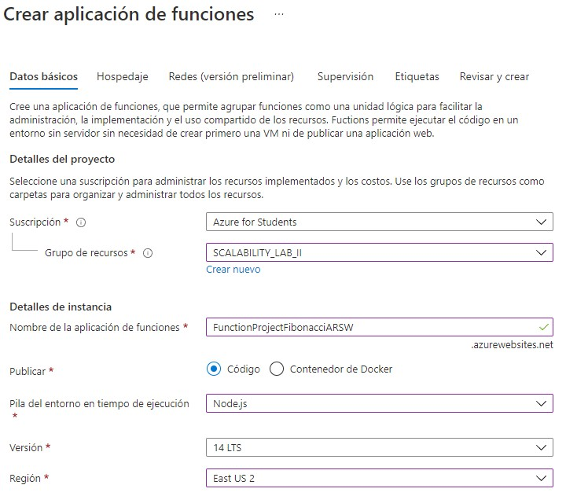
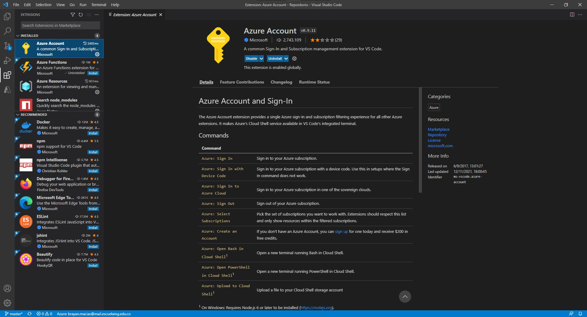

### Escuela Colombiana de Ingeniería
### Arquitecturas de Software - ARSW

### Estudiante
  + Brayan Andrés Macías Turmequé

## Escalamiento en Azure con Maquinas Virtuales, Sacale Sets y Service Plans

### Dependencias
* Cree una cuenta gratuita dentro de Azure.
  
  
  
### Creacion de la Function App en Azure
1. Creamos un nuevo recurso Function App. La configuración inicial es esta.
   
   
   
3. En el apartado de "Hospedaje" dejamos la siguiente configuración.
   
   
   
4. El resto de apartados los dejamos como estan. Si estamos seguros le damos en "crear".
   
   
   
5. Cuando el recurso ya esté implementado deberíamos poder ver algo así.
   
   
   

### Despliegue desde Viusla Studio Code
1. Buscamos en la market Place de extensiones de Visual Studio la extensión "Azure Functions" y la instalamos.
   
   
   
2. También va a ser necesaria la instalación de la extensión "Azure Acount" para poder loguearnos en Azure.
   
   
   
3. Una vez nos hallamos logueado en Azure, verficamos que nuestra Fucntion App creada anteriormente nos aparece.
   
   
   
4. Ahora buscamos la carpeta donde tenemos guardada la función que desplegaremos. Haremos Click derecho sobre la carpeta contenedora y vamos a la opción de "Deploy to Function App".
   
   
   

### Probando la Función.
1. Sin Memoization.

   Resultados
   
   

    Notamos que los tiempos de respuesta son bastante altos, esto porque al no tener memorización la función siempre necesita del valor anterior y es necesario recorrer todas las soluciones anteriores al valor que estamos calculando.
    Como ventaja en este punto, es que se puede realizar el cálculo para valores relativamente grandes.

  3. Con Memoization
  
     + Implementación
      
        
      
     + Resultados

        
   
      En el caso de la función con memorización, se están calculando resultados una sola vez, de manera que cuando haya un resultado que ya hasido calculado, este simplemente se devuelve porque ya está almacenado. También, como la función es recursiva la cantidad de valores recalculados es bastante alta, pero con memorización resolvemos esto y evitamos tener que extendernos en todas las ramas a todos los nodos de soluciones triviales.
      Aunque aquí los tiempos se redujeron notablemente, como desventaja tenemos que debido a los límites de recursión no se puede calcular para valores muy grandes.

**Preguntas**

* ¿Qué es un Azure Function?
  + Se pueden dedifnir como pequeños scripts o funciones que se ejecutan en la nube. Por lo que no es necesario contar con una infraestructura especifica para ejecutalo    logrando que el proceso de desarollo sea mas productivo.

* ¿Qué es serverless?
  + Su definición sería algo como "computación sin servidor" es un modelo de computacion que consiste en el concepto de desarollar cosas en la nube. El desarollador solo se enfoca en codificar las "funciones" o los "scripts" pero la infraestructura y todo lo que se necesite para ejecutar esa función se encuentra en la nube ofrecido por proveedores en este tipo de computación. Las conocidas FaaS.

* ¿Qué es el runtime y que implica seleccionarlo al momento de crear el Function App?
  + Es el intervalo de tiempo en el que un programa de computadora se ejecuta en un sistema operativo. En Azure esta principalmente está relacionado con la versión de .NET en la que se basa el tiempo de ejecución.al seleccionar un plan, en este caso el plan Consumption y la versión de runtime 2, se especifica que la duracion es de 5 minutos, osea el tiempo que se mantendra ejecutando la función en memoria de manera continua en la nube.

* ¿Por qué es necesario crear un Storage Account de la mano de un Function App?
  + Porque el Storage Account nos proporciona un espacio de nombres unico para poder almacenar todos los datos
provenientes de Azure Storage, y sean accesiles a través de HTTP

* ¿Cuáles son los tipos de planes para un Function App?, ¿En qué se diferencias?, mencione ventajas y desventajas de cada uno de ellos.
  + Existen tres tipos de planes para un Function App:
    1. Plan Consumo: Cuando usa el plan de consumo, las instancias del host de Azure Functions se agregan y quitan dinámicamente según la cantidad de eventos entrantes. Este plan sin servidor se escala automáticamente y se le cobra por los recursos informáticos solo cuando sus funciones están en ejecución.
       - Pague solo cuando sus funciones se estén ejecutando
       - Escale automáticamente, incluso durante períodos de alta carga
        
    2. Plan Premiun: El plan Premium de Azure Functions ofrece a los clientes las mismas características y el mismo mecanismo de escalado que se utilizan en el plan Consumos in arranque en frío, con rendimiento mejorado y acceso a VNET. El plan Premium de Azure Functions se factura según el volumen de vCPU y memoria que consumen las funciones.
       - Instancias perpetuamente calientes para evitar cualquier arranque en frío
       - Conectividad de red virtual
       - Duración de ejecución ilimitada (60 minutos garantizados)
       - Tamaños de instancia premium (instancias de un núcleo, dos núcleos y cuatro núcleos)
       - Precios más predecibles
       - Asignación de aplicaciones de alta densidad para planes con aplicaciones de múltiples funciones
        
    3. Plan de Azure App Service: Sus aplicaciones de función también pueden ejecutarse en las mismas máquinas virtuales dedicadas que otras aplicaciones de App Service (SKU básicas, estándar, premium y aisladas).
       - Tiene máquinas virtuales infrautilizadas existentes que ya están ejecutando otras instancias de App Service.
       - Desea proporcionar una imagen personalizada en la que ejecutar sus funciones.

* ¿Por qué la memoization falla o no funciona de forma correcta?

    Porque la memoria podría llegar a no ser suficiente y/o porque se logra llegar al límite de recursión.

* ¿Cómo funciona el sistema de facturación de las Function App?
  + El plan de consumo de Azure Functions se factura en función del consumo de recursos y las ejecuciones por segundo pero esto puede variar según el plan:
    1. Plan Consumo: Solo se le cobrará por el tiempo que se ejecute la aplicación de funciones. Este plan incluye una concesión gratuita por suscripción.
    2. Plan Premiun: Proporciona las mismas características y mecanismo de escalado que el plan de consumo, pero con un rendimiento mejorado y acceso a redes virtuales. El costo se basa en el plan de tarifa elegido. Para más información, consulte Plan Premium de Azure Functions.
    3. Plan de Azure App Service: Cuando necesite ejecutar en máquinas virtuales dedicadas o en aislamiento, utilice imágenes personalizadas o quiera usar el exceso de capacidad del plan de App Service. Usa la facturación del plan de App Service regular. El costo se basa en el plan de tarifa elegido

* Informe

  **Realizado antes de las Preguntas**
